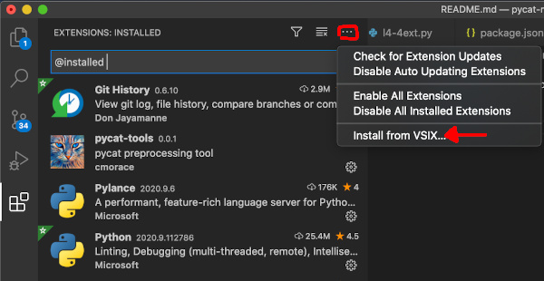
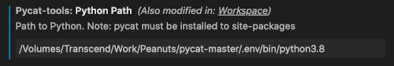

# pycat-tools

An pycat extension for VS Code

## Installation

1. In VS Code's extensions view, click on the "Views and More Actions" button and then Install from VSIX...

    

2. Select the file pycat-tools-0.0.1.vsix

3. If you are using virtual environments, go to extension settings and enter the absolute path to the python distribution where pycat is installed.

    - example

    

## Development

### Testing

To test the extension open the pycat-tools directory as a VS Code workspace and press `F5` to open a test project emulating a workspace with the extension installed.

### Packaging

Make sure `vsce` is installed

``` bash
npm install -g vsce
```

Then run
``` bash
vsce package
```
to generate a vsix file
